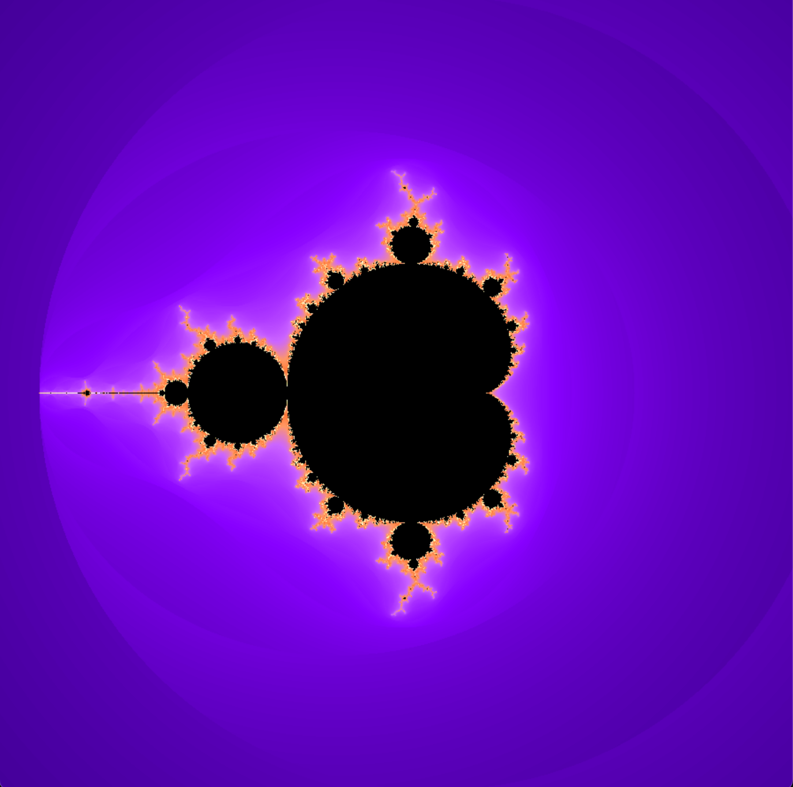
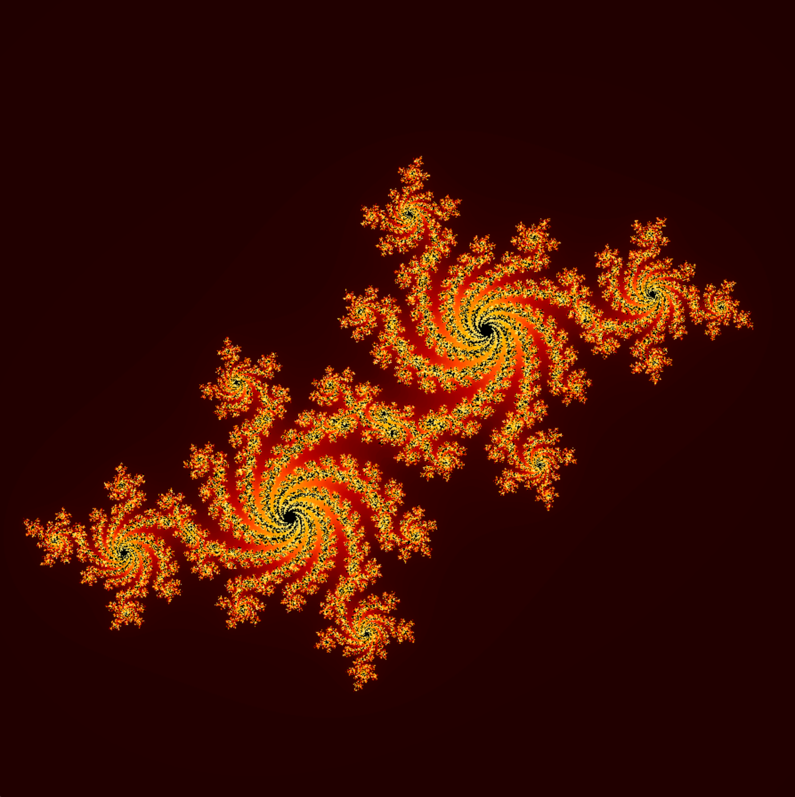

# Fract-ol

## Overview

**Fract-ol** is a 42 school project designed to explore the fascinating world of fractals using the **MiniLibX** graphical library. This project focuses on rendering complex mathematical sets such as the Mandelbrot, Julia, and Burning Ship sets, while implementing smooth color transitions, interactive zoom, and multiple color themes.

## Features

- **Fractal Sets**: Mandelbrot, Julia, and Burning Ship.
- **Interactivity**: Smooth real-time zooming and movement.
- **Color Themes**: Over 10 custom color themes (Dracula, Tokyo Night, Lava, etc.).
- **Visual Enhancements**: Smooth color transitions and optional color shifting.
- **Cross-Platform**: Compatible with both Linux and macOS.

## Fractals

|          Mandelbrot           |        Julia        |      Zoomed Mandelbrot       |
| :---------------------------: | :-----------------: | :--------------------------: |
|  |  |  |

## Usage

### Build

To compile the project, run:

```bash
make
```

For bonus features (if available):

```bash
make bonus
```

### Execution

```bash
./fractol <ensemble_name> [options]
```

#### Examples:

```bash
# Render Mandelbrot
./fractol mandelbrot

# Render Julia with custom constants
./fractol julia -0.8 0.156

# Render Burning Ship with a specific theme
./fractol burning_ship --theme=lava --iter=150
```

### Options

| Option                 | Description                        | Values                                                                                                        |
| :--------------------- | :--------------------------------- | :------------------------------------------------------------------------------------------------------------ |
| `--theme=<name>`       | Color theme for the fractal        | `default`, `red`, `blue`, `purple`, `black_white`, `lava`, `sky`, `psyche`, `autumn`, `tokyonight`, `dracula` |
| `--iter=<value>`       | Base number of iterations (30-255) | Default: `100`                                                                                                |
| `--smooth=<bool>`      | Enable/Disable smooth transitions  | `true`, `false` (Default: `true`)                                                                             |
| `--color_shift=<bool>` | Change colors during zoom          | `true`, `false` (Default: `false`)                                                                            |

## Controls

| Key/Mouse      | Action                               |
| :------------- | :----------------------------------- |
| `ESC`          | Quit the application                 |
| `Arrow Keys`   | Move the view                        |
| `Mouse Scroll` | Zoom In/Out (follows mouse position) |
| `T`            | Cycle through color themes           |

## Technical Implementation

The project uses the **MiniLibX** library for window management and pixel manipulation.

- **Optimization**: Uses pre-computed coordinates and optimized math to ensure smooth rendering.
- **Coloring**: Implements a smooth escape time algorithm to avoid banding effects.
- **Memory Management**: Ensures all resources are properly freed on exit.

---

_Developed by afaugero as part of the 42 Cursus._
